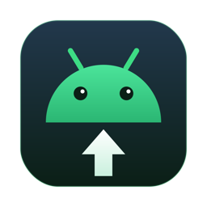

<div align="center">



# Droidie

**Drag & drop file transfer between your Mac and Android — no cables required, no Android Studio.**

[](https://github.com/miggiman/droidie/actions/workflows/ci.yml)


[](LICENSE)

</div>

---

Droidie is a tiny macOS menu bar app that moves files to and from Android devices over adb — via USB **or** wireless debugging. Built because Quick Share isn't available for every phone and third-party transfer tools kept flaking out.

## Features

- 📱 **Live device list** — devices appear/disappear in real time (adb `track-devices` socket, no polling)
- 📥 **Drag & drop to phone** — drop files on the popover or straight onto the menu bar icon
- 🗂 **Browse device storage** — navigate folders, pull files to your Mac, or drag them directly into Finder
- 📶 **Wireless pairing built in** — pair over WiFi with the IP + 6-digit code, reconnect with one click
- 📊 **Transfer progress** — per-file progress bars, overall percentage in the menu bar
- 🕐 **Fresh timestamps** — pushed files get the copy time, so they sort to the top on the phone
- 🖼 **Instant visibility** — pushed files are indexed in MediaStore right away (Gallery, Files, Photos)
- 🧰 **Zero dependencies** — pure Swift + system frameworks; adb does the heavy lifting

## Install

**Requirements:** macOS 14+, [Android platform tools](https://developer.android.com/tools/releases/platform-tools):

```bash
brew install android-platform-tools
```

**Build & install Droidie:**

```bash
git clone https://github.com/miggiman/droidie.git
cd droidie
./scripts/make-app.sh
cp -R dist/Droidie.app /Applications/
open /Applications/Droidie.app
```

A phone icon appears in your menu bar. On the phone, enable **USB debugging** (or **Wireless debugging**) in Developer options.

## Usage

### Send files (Mac → Android)

1. Click the menu bar icon → **Send** tab
2. Drop files or folders on the drop zone — done

Shortcuts:
- Drop files **directly on the menu bar icon** — pushes without opening the popover
- **Drag a file over the icon** mid-drag — the popover opens so you can drop into a specific folder via the Browse tab

### Get files (Android → Mac)

1. **Browse** tab → navigate with the `›` chevrons
2. Select files (⌘-click for multiple) → **Save to Mac**, or
3. Grab a file's **≡ handle** and drag it straight into any Finder window — it lands exactly where you drop it

### Wireless setup (once per device)

1. Phone: *Settings → Developer options → Wireless debugging → Pair device with pairing code*
2. Droidie: **+ Pair** → enter the pairing `IP:port`, the 6-digit code, and the connect `IP:port` from the main Wireless debugging screen
3. Droidie remembers the endpoint — next time it's one click on **⟳ Reconnect**

## How it works

```
┌─────────────┐   host:track-devices-l    ┌────────────┐        ┌─────────┐
│   Droidie    │◄──────socket :5037──────►│ adb server │◄──USB──│ Android │
│ (menu bar)  │───push/pull/pair/shell───►│            │◄─WiFi──│ device  │
└─────────────┘        subprocess          └────────────┘        └─────────┘
```

- **Device tracking:** a raw socket to the adb server streams live device events — no polling
- **Everything else:** plain `adb` subprocesses (`push`, `pull`, `pair`, `connect`, `shell`)
- **State:** adb's own server keeps device authorization; Droidie stores only preferences in UserDefaults

## Development

```bash
swift build          # debug build
swift test           # 55 unit tests, no device needed
./scripts/make-app.sh  # release build → dist/Droidie.app
```

The package splits into `DroidieCore` (all logic, fully unit-tested against fake adb fixtures) and `Droidie` (thin AppKit/SwiftUI shell). Design docs live in [`docs/superpowers/`](docs/superpowers/).

## Limitations (v1)

- One transfer at a time (serial queue — adb doesn't parallelize well anyway)
- No thumbnails in the browser
- Dragging out of the Browse tab works for files, not folders

## License

[MIT](LICENSE)
